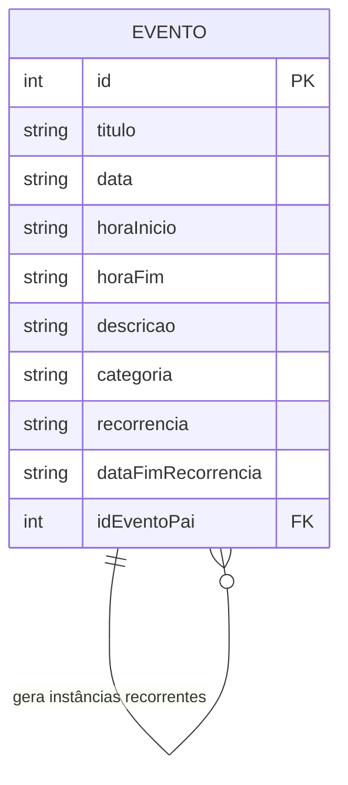

# Architecture — My Calendar

## 1. Visão Geral

My Calendar é uma aplicação SPA (Single Page Application) construída com HTML5, CSS3 e JavaScript vanilla, sem dependência de frameworks frontend. O backend é simulado via JSON Server, e o localStorage é utilizado como cache local dos dados.

```
┌─────────────────────────────────────────────┐
│                  Navegador                   │
│                                             │
│  ┌─────────┐  ┌──────────┐  ┌───────────┐  │
│  │  HTML   │  │   CSS    │  │    JS     │  │
│  │ (DOM)   │◄─┤ (Tokens) │◄─┤ (Módulos) │  │
│  └─────────┘  └──────────┘  └─────┬─────┘  │
│                                    │        │
│                          fetch/async│await   │
│                                    │        │
│                     ┌──────────────┤        │
│                     │              │        │
│              ┌──────▼─────┐ ┌─────▼──────┐ │
│              │ localStorage│ │ JSON Server│ │
│              │  (cache)    │ │  (API)     │ │
│              └────────────┘ └─────┬──────┘ │
└──────────────────────────────────┼─────────┘
                                   │
                            ┌──────▼──────┐
                            │   db.json   │
                            │ (banco fake) │
                            └─────────────┘
```

---

## 2. Stack Tecnológica

| Camada | Tecnologia | Justificativa |
|--------|------------|---------------|
| **Estrutura** | HTML5 | Semântica e acessibilidade nativa |
| **Estilização** | CSS3 (vanilla) | Design Tokens via CSS Variables, layout com Flexbox/Grid |
| **Lógica** | JavaScript ES6+ (vanilla) | Módulos, classes, fetch API, destructuring |
| **Backend Fake** | JSON Server | Simulação de API REST com CRUD completo |
| **Persistência** | localStorage | Cache offline e dados de preferências do usuário |
| **Comunicação** | fetch / async/await | Requisições assíncronas à API REST |

---

## 3. Design Tokens (CSS Variables)

Os Design Tokens definem a linguagem visual padronizada da aplicação. Todos os valores visuais são centralizados em variáveis CSS no arquivo `css/variables.css`.

### 3.1 Cores

```css
:root {
  /* Cores base */
  --color-primary: #4285F4;
  --color-bg: #FFFFFF;
  --color-bg-secondary: #F8F9FA;
  --color-text: #202124;
  --color-text-secondary: #5F6368;
  --color-border: #DADCE0;

  /* Estado */
  --color-today: #E8F0FE;
  --color-hover: #F1F3F4;
  --color-danger: #D93025;

  /* Categorias */
  --color-work: #4285F4;        /* Azul - Trabalho */
  --color-personal: #0B8043;    /* Verde - Pessoal */
  --color-health: #D50000;      /* Vermelho - Saúde */
  --color-studies: #8E24AA;     /* Roxo - Estudos */
  --color-other: #616161;       /* Cinza - Outro */
}
```

### 3.2 Tipografia

```css
:root {
  --font-family: 'Google Sans', Roboto, 'Segoe UI', sans-serif;
  --font-size-xs: 11px;
  --font-size-sm: 12px;
  --font-size-md: 14px;
  --font-size-lg: 16px;
  --font-size-xl: 22px;
  --font-weight-normal: 400;
  --font-weight-medium: 500;
}
```

### 3.3 Espaçamentos

```css
:root {
  --spacing-xs: 2px;
  --spacing-sm: 4px;
  --spacing-md: 8px;
  --spacing-lg: 16px;
  --spacing-xl: 24px;
  --spacing-xxl: 32px;
}
```

### 3.4 Bordas e Sombras

```css
:root {
  --border-radius: 8px;
  --border-radius-sm: 4px;
  --border-radius-full: 50%;
  --shadow-sm: 0 1px 2px rgba(0, 0, 0, 0.1);
  --shadow-md: 0 2px 6px rgba(0, 0, 0, 0.15);
  --shadow-lg: 0 4px 12px rgba(0, 0, 0, 0.2);
}
```

---

## 4. Modelo de Dados (Diagrama ER — Mermaid)



### Descrição do Relacionamento

Um evento pode gerar múltiplas instâncias futuras quando configurado como recorrente. Cada instância gerada referencia o evento original através do campo `idEventoPai`. A exclusão em cascata (excluir todas as ocorrências futuras) remove todas as instâncias cujo `idEventoPai` corresponde ao evento pai.

---

## 5. Entidades e Contratos

### 5.1 Entidade: Evento

| Campo | Tipo | Obrigatório | Validação | Descrição |
|-------|------|-------------|-----------|-----------|
| `id` | number | auto | Auto-incremento (JSON Server) | Identificador único do evento |
| `titulo` | string | sim | `/^.{3,100}$/` | Nome do evento |
| `data` | string (ISO) | sim | Formato `AAAA-MM-DD` | Data do evento |
| `horaInicio` | string | sim | Regex: `/^([01]\|2[0-3]):[0-5]\d$/` | Hora de início (24h) |
| `horaFim` | string | sim | Regex + deve ser > `horaInicio` | Hora de término (24h) |
| `descricao` | string | não | Máximo 500 caracteres | Descrição opcional do evento |
| `categoria` | string | sim | Enum válido | Categoria do evento |
| `recorrencia` | string | sim | Enum válido | Tipo de recorrência |
| `dataFimRecorrencia` | string (ISO) | condicional | Formato `AAAA-MM-DD`, > `data` | Data fim da recorrência |
| `idEventoPai` | number \| null | não | FK → `EVENTO.id` ou `null` | ID do evento pai (instâncias recorrentes) |

### Enums

**Categorias:**

| Valor | Cor | CSS Variable |
|-------|-----|--------------|
| `trabalho` | Azul | `--color-work` |
| `pessoal` | Verde | `--color-personal` |
| `saude` | Vermelho | `--color-health` |
| `estudos` | Roxo | `--color-studies` |
| `outro` | Cinza | `--color-other` |

**Recorrência:**

| Valor | Descrição |
|-------|-----------|
| `none` | Sem recorrência |
| `daily` | Diário |
| `weekly` | Semanal |
| `monthly` | Mensal |
| `yearly` | Anual |

### 5.2 Exemplo de Registro

```json
{
  "id": 1,
  "titulo": "Reunião de projeto",
  "data": "2026-08-25",
  "horaInicio": "14:00",
  "horaFim": "15:30",
  "descricao": "Discussão sobre roadmap do semestre",
  "categoria": "trabalho",
  "recorrencia": "none",
  "dataFimRecorrencia": null,
  "idEventoPai": null
}
```

```json
{
  "id": 2,
  "titulo": "Aula de inglês",
  "data": "2026-08-25",
  "horaInicio": "18:00",
  "horaFim": "19:00",
  "descricao": "",
  "categoria": "estudos",
  "recorrencia": "weekly",
  "dataFimRecorrencia": "2026-12-31",
  "idEventoPai": null
}
```

```json
{
  "id": 3,
  "titulo": "Aula de inglês",
  "data": "2026-09-01",
  "horaInicio": "18:00",
  "horaFim": "19:00",
  "descricao": "",
  "categoria": "estudos",
  "recorrencia": "weekly",
  "dataFimRecorrencia": "2026-12-31",
  "idEventoPai": 2
}
```

---

## 6. Contrato da API (JSON Server)

### Endpoints

| Método | Endpoint | Descrição | Query Params |
|--------|----------|-----------|--------------|
| `GET` | `/events` | Listar todos os eventos | `?date=AAAA-MM-DD`, `?category=X` |
| `GET` | `/events/:id` | Buscar evento por ID | — |
| `POST` | `/events` | Criar novo evento | — |
| `PUT` | `/events/:id` | Atualizar evento existente | — |
| `DELETE` | `/events/:id` | Excluir evento | — |

### Estrutura de Requisição

**Criar evento:**
```http
POST /events HTTP/1.1
Content-Type: application/json

{
  "titulo": "Nova reunião",
  "data": "2026-08-25",
  "horaInicio": "10:00",
  "horaFim": "11:00",
  "descricao": "Reunião de alinhamento",
  "categoria": "trabalho",
  "recorrencia": "none",
  "dataFimRecorrencia": null,
  "idEventoPai": null
}
```

**Resposta (201 Created):**
```json
{
  "id": 4,
  "titulo": "Nova reunião",
  "data": "2026-08-25",
  "horaInicio": "10:00",
  "horaFim": "11:00",
  "descricao": "Reunião de alinhamento",
  "categoria": "trabalho",
  "recorrencia": "none",
  "dataFimRecorrencia": null,
  "idEventoPai": null
}
```

---

## 7. Estrutura de Pastas

```
my-calendar/
├── index.html                # Página principal (SPA)
├── css/
│   ├── reset.css             # Reset do CSS (normalize)
│   ├── variables.css         # Design Tokens (CSS Variables)
│   ├── calendar.css          # Estilos do calendário (grid mensal/semanal/diário)
│   ├── modal.css             # Estilos do modal de criação/edição de eventos
│   ├── form.css              # Estilos de formulários e estados de validação
│   └── responsive.css        # Media queries (mobile-first)
├── js/
│   ├── main.js               # Inicialização e event listeners globais
│   ├── calendar.js           # Renderização das visões (mês/semana/dia)
│   ├── events.js             # CRUD de eventos (fetch + localStorage)
│   ├── modal.js              # Abertura, fechamento e controle de modais
│   ├── form.js               # Validação de formulários com regex
│   ├── recurrence.js         # Lógica de geração de eventos recorrentes
│   ├── dragdrop.js           # Drag-and-drop nas visões semanal e diária
│   └── storage.js            # Abstração de leitura/escrita no localStorage
├── db/
│   └── db.json               # Banco de dados do JSON Server
└── docs/
    ├── prd.md                # Product Requirements Document
    └── architecture.md       # Este documento
```

---

## 8. Padrões de Manipulação do DOM

Todos os elementos visuais do calendário são criados dinamicamente via JavaScript, sem uso de `innerHTML` para templates complexos.

### 8.1 Criação de Elementos

```javascript
function createDayElement(date, events) {
  const dayEl = document.createElement('div');
  dayEl.classList.add('calendar-day');
  dayEl.dataset.date = date.toISOString().split('T')[0];

  const numberEl = document.createElement('span');
  numberEl.classList.add('day-number');
  numberEl.textContent = date.getDate();
  dayEl.appendChild(numberEl);

  events.forEach(event => {
    const eventEl = document.createElement('div');
    eventEl.classList.add('event-chip', `category-${event.categoria}`);
    eventEl.textContent = event.titulo;
    eventEl.draggable = true;
    eventEl.dataset.eventId = event.id;
    dayEl.appendChild(eventEl);
  });

  return dayEl;
}
```

### 8.2 Convenções

| Padrão | Regra |
|--------|-------|
| **Criação** | Usar `document.createElement()` para todos os elementos dinâmicos |
| **Atributos de dados** | Usar `dataset` para armazenar IDs e datas (`data-id`, `data-date`) |
| **Classes** | Usar `classList.add()` / `classList.toggle()` para alternar estados |
| **Eventos** | Usar `addEventListener()` delegado no container pai quando possível |
| **Templates simples** | Permitir `innerHTML` apenas para fragments HTML curtos e controlados |

---

## 9. Uso do localStorage

### 9.1 Chaves

| Chave | Tipo | Conteúdo |
|-------|------|----------|
| `myCalendar_events` | JSON string | Array de eventos (cache do JSON Server) |
| `myCalendar_currentView` | string | `"monthly"` \| `"weekly"` \| `"daily"` |
| `myCalendar_currentDate` | string | Data ISO do centro da visualização atual |

### 9.2 Módulo de Abstração (`storage.js`)

```javascript
const Storage = {
  getEvents() {
    const data = localStorage.getItem('myCalendar_events');
    return data ? JSON.parse(data) : [];
  },

  saveEvents(events) {
    localStorage.setItem('myCalendar_events', JSON.stringify(events));
  },

  getView() {
    return localStorage.getItem('myCalendar_currentView') || 'monthly';
  },

  saveView(view) {
    localStorage.setItem('myCalendar_currentView', view);
  },

  getCurrentDate() {
    return localStorage.getItem('myCalendar_currentDate') || new Date().toISOString().split('T')[0];
  },

  saveCurrentDate(date) {
    localStorage.setItem('myCalendar_currentDate', date);
  }
};
```

### 9.3 Fluxo de Sincronização

```
Ao carregar a página:
  1. Buscar eventos do JSON Server (GET /events)
  2. Salvar resultado no localStorage (cache)
  3. Renderizar calendário

Ao criar/editar/excluir evento:
  1. Enviar requisição ao JSON Server (POST/PUT/DELETE)
  2. Receber resposta e atualizar localStorage
  3. Re-renderizar calendário

Se JSON Server indisponível:
  1. Ler dados do localStorage (modo offline)
  2. Renderizar com dados em cache
```
