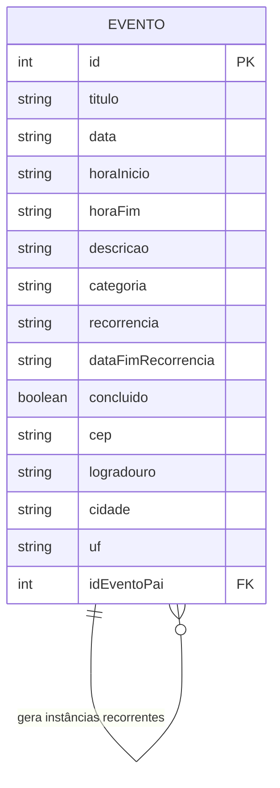

# Architecture — My Calendar

## 1. Visão Geral

My Calendar é uma aplicação web construída com HTML5, JavaScript vanilla e o framework CSS **Bootstrap v5.3.8** para o layout responsivo e componentes. O backend é simulado via JSON Server, o localStorage é utilizado como cache local dos dados e a API pública ViaCEP é consumida para completar endereços a partir do CEP.

```
┌──────────────────────────────────────────────┐
│                  Navegador                    │
│                                              │
│  ┌─────────┐  ┌──────────┐  ┌────────────┐  │
│  │  HTML   │  │   CSS    │  │     JS     │  │
│  │ (3 págs)│◄─┤ (Tokens) │◄─┤ (Módulos)  │  │
│  └─────────┘  └──────────┘  └─────┬──────┘  │
│                                   │          │
│                         fetch/async│await     │
│                                   │          │
│                    ┌──────────────┤          │
│                    │              │          │
│             ┌──────▼─────┐ ┌─────▼────────┐ │
│             │ localStorage│ │ JSON Server  │ │
│             │  (cache)    │ │  (API fake)  │ │
│             └────────────┘ └─────┬────────┘ │
│                                  └────┬─────┘
│                                 ┌─────▼──────┐
│                                 │   db.json   │
│                                 │ (banco fake)│
│                                 └────────────┘
│
│          ┌──────────────────────────────┐
│          │  ViaCEP (API pública)        │
│          │  GET /ws/{cep}/json/          │
│          └──────────────────────────────┘
│
│          ┌──────────────────────────────┐
│          │  Date Nager (API pública)    │
│          │  GET /api/v3/PublicHolidays/ │
│          │      {ano}/BR                │
│          └──────────────────────────────┘
└──────────────────────────────────────────────┘
```

---

## 2. Stack Tecnológica

| Camada | Tecnologia | Versão | Justificativa |
|--------|------------|--------|---------------|
| **Estrutura** | HTML5 | — | 3 páginas distintas: listagem, formulário e estatísticas |
| **Framework CSS** | Bootstrap | v5.3.8 | Grid responsivo (mobile-first), componentes prontos (navbar, card, badge, modal, form) e JS do framework |
| **Estilização complementar** | CSS3 (vanilla) | — | Sobrescritas e extensões dos Design Tokens sobre as variáveis do Bootstrap (`css/variables.css` etc.) |
| **Lógica** | JavaScript ES6+ (vanilla) | — | Módulos, classes, fetch API, destructuring |
| **Backend Fake** | JSON Server | v1.x | Simulação de API REST com CRUD completo |
| **Persistência** | localStorage | — | Cache offline e dados de preferências do usuário |
| **API Pública** | ViaCEP | v1 | Consulta assíncrona de endereço a partir do CEP |
| **API Pública** | Date Nager | v3 | Consulta assíncrona de feriados nacionais (Brasil) |
| **Comunicação** | fetch / async/await | — | Requisições assíncronas à API REST, ao ViaCEP e ao Date Nager |

### Mapa de Versões das Tecnologias

| Tecnologia | Versão exata | Registro |
|------------|--------------|----------|
| Bootstrap | v5.3.8 | Carregado via CDN em todas as páginas HTML |
| JSON Server | v1.x (determinada no `npm install`) | `package.json` (`devDependencies`) |
| ViaCEP | v1 | API pública, consumida via endpoint `/ws/{cep}/json/` sem registro |
| Date Nager | v3 | API pública, consumida via endpoint `/api/v3/PublicHolidays/{ano}/{pais}` sem registro |

---

## 3. Design Tokens (CSS Variables)

Os Design Tokens definem a linguagem visual padronizada da aplicação. Como o layout é construído com **Bootstrap v5.3.8**, os tokens da aplicação sobrescrevem as variáveis CSS do framework (`--bs-*`) no arquivo `css/variables.css`, garantindo consistência visual em todos os componentes do Bootstrap (navbar, cards, badges, forms e modais).

### 3.1 Cores

Os tokens de cor mapeiam a paleta da aplicação para as variáveis do Bootstrap:

```css
:root {
  /* Cores base */
  --color-primary: #4285F4;
  --color-bg: #FFFFFF;
  --color-bg-secondary: #F8F9FA;
  --color-text: #202124;
  --color-text-secondary: #5F6368;
  --color-border: #DADCE0;

  /* Estado */
  --color-hover: #F1F3F4;
  --color-danger: #D93025;

  /* Categorias */
  --color-work: #4285F4;        /* Azul - Trabalho */
  --color-personal: #0B8043;    /* Verde - Pessoal */
  --color-health: #D50000;      /* Vermelho - Saúde */
  --color-studies: #8E24AA;     /* Roxo - Estudos */
  --color-other: #616161;       /* Cinza - Outro */
}

/* Mapeamento para as variáveis do Bootstrap v5.3.8 */
:root {
  --bs-primary: #4285F4;
  --bs-body-bg: #FFFFFF;
  --bs-body-color: #202124;
  --bs-border-color: #DADCE0;
  --bs-border-radius: 8px;
}
```

### 3.2 Tipografia

```css
:root {
  --font-family: 'Google Sans', Roboto, 'Segoe UI', sans-serif;
  --font-size-xs: 11px;
  --font-size-sm: 12px;
  --font-size-md: 14px;
  --font-size-lg: 16px;
  --font-size-xl: 22px;
  --font-size-xxl: 28px;
  --font-weight-normal: 400;
  --font-weight-medium: 500;
  --font-weight-bold: 700;
}

/* Mapeamento para o Bootstrap */
:root {
  --bs-font-sans-serif: var(--font-family);
}
```

### 3.3 Espaçamentos

```css
:root {
  --spacing-xs: 2px;
  --spacing-sm: 4px;
  --spacing-md: 8px;
  --spacing-lg: 16px;
  --spacing-xl: 24px;
  --spacing-xxl: 32px;
}
```

### 3.4 Bordas e Sombras

```css
:root {
  --border-radius: 8px;
  --border-radius-sm: 4px;
  --shadow-sm: 0 1px 2px rgba(0, 0, 0, 0.1);
  --shadow-md: 0 2px 6px rgba(0, 0, 0, 0.15);
  --shadow-lg: 0 4px 12px rgba(0, 0, 0, 0.2);
}
```

---

## 4. Modelo de Dados (Diagrama ER — Mermaid)



### Descrição do Relacionamento

Um evento pode gerar múltiplas instâncias futuras quando configurado como recorrente. Cada instância gerada referencia o evento original através do campo `idEventoPai`. A exclusão em cascata (excluir todas as ocorrências futuras) remove todas as instâncias cujo `idEventoPai` corresponde ao evento pai.

---

## 5. Entidades e Contratos

### 5.1 Entidade: Evento

| Campo | Tipo | Obrigatório | Validação | Descrição |
|-------|------|-------------|-----------|-----------|
| `id` | number | auto | Auto-incremento (JSON Server) | Identificador único do evento |
| `titulo` | string | sim | `/^.{3,100}$/` | Nome do evento |
| `data` | string (ISO) | sim | Formato `AAAA-MM-DD` | Data do evento |
| `horaInicio` | string | sim | Regex: `/^([01]\|2[0-3]):[0-5]\d$/` | Hora de início (24h) |
| `horaFim` | string | sim | Regex + deve ser > `horaInicio` | Hora de término (24h) |
| `descricao` | string | não | Máximo 500 caracteres | Descrição opcional do evento |
| `categoria` | string | sim | Enum válido | Categoria do evento |
| `recorrencia` | string | sim | Enum válido | Tipo de recorrência |
| `dataFimRecorrencia` | string (ISO) | condicional | Formato `AAAA-MM-DD`, > `data` | Data fim da recorrência |
| `concluido` | boolean | sim | `true` \| `false` | Indica se o evento foi realizado |
| `cep` | string | não | Regex: `/^[0-9]{5}-[0-9]{3}$/` | CEP do local do evento |
| `logradouro` | string | não | Máximo 200 caracteres | Endereço do local (preenchido via ViaCEP) |
| `cidade` | string | não | Máximo 100 caracteres | Cidade do evento |
| `uf` | string | não | Regex: `/[A-Z]{2}/` | Unidade federativa |
| `idEventoPai` | number \| null | não | FK → `EVENTO.id` ou `null` | ID do evento pai (instâncias recorrentes) |

### Enums

**Categorias:**

| Valor | Cor | CSS Variable |
|-------|-----|--------------|
| `trabalho` | Azul | `--color-work` |
| `pessoal` | Verde | `--color-personal` |
| `saude` | Vermelho | `--color-health` |
| `estudos` | Roxo | `--color-studies` |
| `outro` | Cinza | `--color-other` |

**Recorrência:**

| Valor | Descrição |
|-------|-----------|
| `none` | Sem recorrência |
| `daily` | Diário |
| `weekly` | Semanal |
| `monthly` | Mensal |
| `yearly` | Anual |

### 5.2 Exemplo de Registro

```json
{
  "id": 1,
  "titulo": "Reunião de projeto",
  "data": "2026-08-25",
  "horaInicio": "14:00",
  "horaFim": "15:30",
  "descricao": "Discussão sobre roadmap do semestre",
  "categoria": "trabalho",
  "recorrencia": "none",
  "dataFimRecorrencia": null,
  "concluido": false,
  "cep": "80010-010",
  "logradouro": "Rua das Flores",
  "cidade": "Curitiba",
  "uf": "PR",
  "idEventoPai": null
}
```

```json
{
  "id": 2,
  "titulo": "Aula de inglês",
  "data": "2026-08-25",
  "horaInicio": "18:00",
  "horaFim": "19:00",
  "descricao": "",
  "categoria": "estudos",
  "recorrencia": "weekly",
  "dataFimRecorrencia": "2026-12-31",
  "concluido": false,
  "cep": null,
  "logradouro": null,
  "cidade": null,
  "uf": null,
  "idEventoPai": null
}
```

---

## 6. Contrato da API

### 6.1 JSON Server (API Fake)

**Endpoints:**

| Método | Endpoint | Descrição | Query Params |
|--------|----------|-----------|--------------|
| `GET` | `/events` | Listar todos os eventos | `?categoria=X`, `?_sort=data` |
| `GET` | `/events/:id` | Buscar evento por ID | — |
| `POST` | `/events` | Criar novo evento | — |
| `PUT` | `/events/:id` | Atualizar evento existente | — |
| `DELETE` | `/events/:id` | Excluir evento | — |

**Estrutura de Requisição — Criar evento:**
```http
POST /events HTTP/1.1
Content-Type: application/json

{
  "titulo": "Consulta médica",
  "data": "2026-09-10",
  "horaInicio": "09:00",
  "horaFim": "10:00",
  "descricao": "Check-up anual",
  "categoria": "saude",
  "recorrencia": "yearly",
  "dataFimRecorrencia": "2030-09-10",
  "concluido": false,
  "cep": "80020-000",
  "logradouro": "Rua XV de Novembro",
  "cidade": "Curitiba",
  "uf": "PR",
  "idEventoPai": null
}
```

**Resposta (201 Created):**
```json
{
  "id": 4,
  "titulo": "Consulta médica",
  "data": "2026-09-10",
  "horaInicio": "09:00",
  "horaFim": "10:00",
  "descricao": "Check-up anual",
  "categoria": "saude",
  "recorrencia": "yearly",
  "dataFimRecorrencia": "2030-09-10",
  "concluido": false,
  "cep": "80020-000",
  "logradouro": "Rua XV de Novembro",
  "cidade": "Curitiba",
  "uf": "PR",
  "idEventoPai": null
}
```

### 6.2 ViaCEP (API Pública)

**Endpoint de consulta:**

| Método | Endpoint | Descrição |
|--------|----------|-----------|
| `GET` | `https://viacep.com.br/ws/{cep}/json/` | Consultar endereço a partir do CEP (formato `00000-000`) |

**Resposta (200 OK):**
```json
{
  "cep": "80020-000",
  "logradouro": "Rua XV de Novembro",
  "bairro": "Centro",
  "localidade": "Curitiba",
  "uf": "PR",
  "erro": false
}
```

**Tratamento de erro (CEP inexistente):** a API retorna o campo `"erro": true`. Para CEPs com formato inválido, a aplicação bloqueia a requisição na validação de formulário.

### 6.3 Date Nager (API Pública — Feriados)

**Endpoint de consulta:**

| Método | Endpoint | Descrição |
|--------|----------|-----------|
| `GET` | `https://date.nager.at/api/v3/PublicHolidays/{ano}/BR` | Listar feriados nacionais do Brasil em um ano |

**Resposta (200 OK):**
```json
[
  {
    "date": "2026-09-07",
    "localName": "Dia da Independência",
    "name": "Independence Day",
    "countryCode": "BR",
    "fixed": false,
    "global": true,
    "counties": null,
    "launchYear": null,
    "types": ["Public"]
  },
  {
    "date": "2026-12-25",
    "localName": "Natal",
    "name": "Christmas Day",
    "countryCode": "BR",
    "fixed": false,
    "global": true,
    "counties": null,
    "launchYear": null,
    "types": ["Public"]
  }
]
```

**Uso na aplicação:** na página `index.html`, a listagem consulta os feriados do ano corrente, armazena em cache no localStorage e, para cada card cuja data do evento coincide com um feriado, exibe um badge com o nome em português (`localName`).

**Tratamento de erro:** se a requisição falhar ou retornar status diferente de `200`, a listagem é renderizada normalmente sem as indicações de feriado (comportamento degradado), sem interromper as demais funcionalidades.

---

## 7. Estrutura de Pastas

```
my-calendar/
├── index.html                # Página principal: listagem de eventos em cards (Bootstrap via CDN)
├── evento.html               # Formulário de criação/edição de eventos (Bootstrap via CDN)
├── estatisticas.html         # Página de estatísticas da agenda (Bootstrap via CDN)
├── css/
│   ├── variables.css         # Design Tokens: sobrescreve variáveis do Bootstrap
│   ├── layout.css            # Ajustes de header, navegação e espaçamentos
│   ├── cards.css             # Extensões dos cards do Bootstrap para eventos
│   └── form.css              # Ajustes de formulários e estados de validação
├── js/
│   ├── main.js               # Inicialização, busca e filtro por categoria
│   ├── events.js             # CRUD de eventos (fetch + localStorage)
│   ├── form.js               # Validação de formulários + consumo do ViaCEP
│   ├── recurrence.js         # Lógica de geração de eventos recorrentes
│   ├── stats.js              # Cálculo e exibição de estatísticas
│   └── storage.js            # Abstração de leitura/escrita no localStorage
├── db/
│   └── db.json               # Banco de dados do JSON Server
└── docs/
    ├── prd.md                # Product Requirements Document
    └── architecture.md       # Este documento
```

> **Nota:** O `reset.css` foi substituído pelo `_reboot` nativo do Bootstrap v5.3.8. O `responsive.css` foi suprimido porque o grid responsivo é entregue pelo Bootstrap.


## 8. Padrões de Manipulação do DOM com Bootstrap

Todos os elementos visuais da listagem são criados dinamicamente via JavaScript, reutilizando as classes e componentes do **Bootstrap v5.3.8** (`card`, `badge`, `modal`, utilitários de espaçamento e cor).

### 8.1 Criação de Cards (componente `.card` do Bootstrap)

```javascript
function createEventCard(event) {
  const cardEl = document.createElement('article');
  cardEl.className = 'card event-card h-100';
  if (event.concluido) cardEl.classList.add('event-card--done');
  cardEl.dataset.eventId = event.id;

  const bodyEl = document.createElement('div');
  bodyEl.className = 'card-body d-flex flex-column gap-1';
  cardEl.appendChild(bodyEl);

  const headerEl = document.createElement('div');
  headerEl.className = 'd-flex justify-content-between align-items-start';
  bodyEl.appendChild(headerEl);

  const titleEl = document.createElement('h3');
  titleEl.className = 'card-title h6 mb-0';
  titleEl.textContent = event.titulo;
  headerEl.appendChild(titleEl);

  const badgeEl = document.createElement('span');
  badgeEl.className = 'badge text-bg-' + CATEGORIAS[event.categoria].badge;
  badgeEl.textContent = CATEGORIAS[event.categoria].label;
  headerEl.appendChild(badgeEl);

  const metaEl = document.createElement('p');
  metaEl.className = 'card-text text-body-secondary small';
  metaEl.textContent = `${formatDate(event.data)} · ${event.horaInicio} – ${event.horaFim}`;
  bodyEl.appendChild(metaEl);

  if (event.descricao) {
    const descEl = document.createElement('p');
    descEl.className = 'card-text small';
    descEl.textContent = event.descricao;
    bodyEl.appendChild(descEl);
  }

  const holiday = FERIADOS.get(event.data);
  if (holiday) {
    const holidayEl = document.createElement('span');
    holidayEl.className = 'badge text-bg-secondary';
    holidayEl.textContent = `Feriado — ${holiday.localName}`;
    bodyEl.appendChild(holidayEl);
  }

  return cardEl;
}
```

**Nova linha**: o badge de feriado é exibido somente quando a data do evento coincide com uma data em `FERIADOS` (Mapa de `localDate → feriado`, obtido da API Date Nager e armazenado em cache).

### 8.2 Convenções

| Padrão | Regra |
|--------|-------|
| **Criação** | Usar `document.createElement()` somado às classes do Bootstrap (`card`, `badge`, `modal`, utilitários) |
| **Atributos de dados** | Usar `dataset` para armazenar IDs (`data-id`) e classes Bootstrap `data-bs-*` para componentes JS do framework |
| **Grid** | Usar as classes responsivas do Bootstrap (`row`, `col-*`, `g-*`) em vez de media queries manuais |
| **Componentes JS** | Modal, navbar e collapse usam os componentes nativos do Bootstrap (ex: `data-bs-toggle`) |
| **Eventos** | Usar `addEventListener()` delegado no container pai quando possível |
| **Templates simples** | Permitir `innerHTML` apenas para fragments HTML curtos e controlados |

---

## 9. Uso do localStorage

### 9.1 Chaves

| Chave | Tipo | Conteúdo |
|-------|------|----------|
| `myCalendar_events` | JSON string | Array de eventos (cache do JSON Server) |
| `myCalendar_search` | string | Termo de busca persistido entre sessões |
| `myCalendar_filter` | string | Categoria selecionada no filtro (`todas` ou valor de categoria) |
| `myCalendar_feriados` | JSON string | Cache dos feriados: objeto `{ ano, dados }` (Date Nager) |

### 9.2 Módulo de Abstração (`storage.js`)

```javascript
const Storage = {
  getEvents() {
    const data = localStorage.getItem('myCalendar_events');
    return data ? JSON.parse(data) : [];
  },

  saveEvents(events) {
    localStorage.setItem('myCalendar_events', JSON.stringify(events));
  },

  getSearch() {
    return localStorage.getItem('myCalendar_search') || '';
  },

  saveSearch(term) {
    localStorage.setItem('myCalendar_search', term);
  },

  getFilter() {
    return localStorage.getItem('myCalendar_filter') || 'todas';
  },

  saveFilter(category) {
    localStorage.setItem('myCalendar_filter', category);
  },

  getFeriados() {
    const data = localStorage.getItem('myCalendar_feriados');
    return data ? JSON.parse(data) : null;
  },

  saveFeriados(ano, feriados) {
    localStorage.setItem('myCalendar_feriados', JSON.stringify({ ano, dados: feriados }));
  }
};
```

### 9.3 Fluxo de Sincronização

```
Ao carregar a listagem:
  1. Buscar eventos do JSON Server (GET /events)
  2. Salvar resultado no localStorage (cache)
  3. Buscar feriados do ano corrente (GET /api/v3/PublicHolidays/{ano}/BR)
  4. Salvar feriados no localStorage (cache: myCalendar_feriados)
  5. Renderizar cards aplicando busca, filtro e badges de feriado

Ao criar/editar/excluir/alternar conclusão de evento:
  1. Enviar requisição ao JSON Server (POST/PUT/DELETE)
  2. Receber resposta e atualizar localStorage
  3. Re-renderizar listagem ou redirecionar para a página principal

No formulário (campo CEP):
  1. Validar CEP com regex
  2. Consultar a API ViaCEP via fetch
  3. Preencher logradouro, cidade e UF automaticamente

Se JSON Server indisponível:
  1. Ler dados do localStorage (modo offline)
  2. Renderizar com dados em cache

Se API de feriados indisponível:
  1. Renderizar a listagem sem os badges de feriado (comportamento degradado)
```

---

## 10. Páginas da Aplicação

Todas as páginas carregam o **Bootstrap v5.3.8** via CDN (CSS e bundle JS do framework) e o arquivo `css/variables.css` com os Design Tokens.

| Página | Descrição | Scripts |
|--------|-----------|---------|
| `index.html` | Listagem de eventos em cards com busca, filtro por categoria, controle de conclusão e badges de feriados nacionais (Date Nager) | `main.js`, `events.js`, `storage.js` |
| `evento.html` | Formulário de criação/edição com validação (HTML nativo + regex) e consulta ViaCEP | `form.js`, `events.js`, `recurrence.js`, `storage.js` |
| `estatisticas.html` | Resumo da agenda: total de eventos, por categoria, concluídos e pendentes | `stats.js`, `events.js`, `storage.js` |